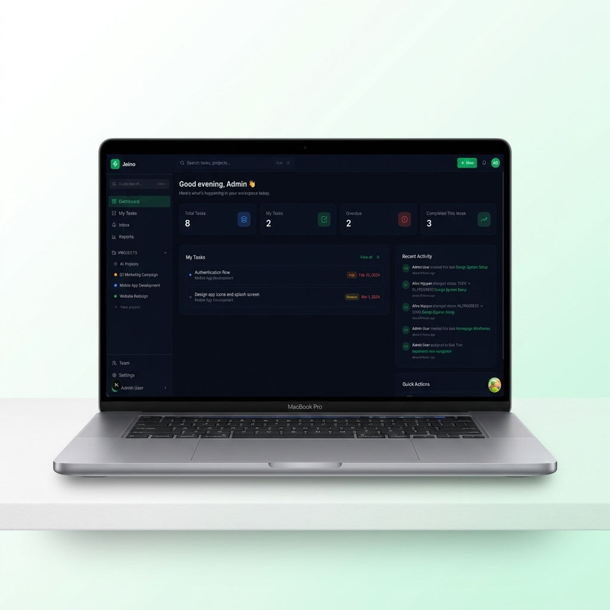
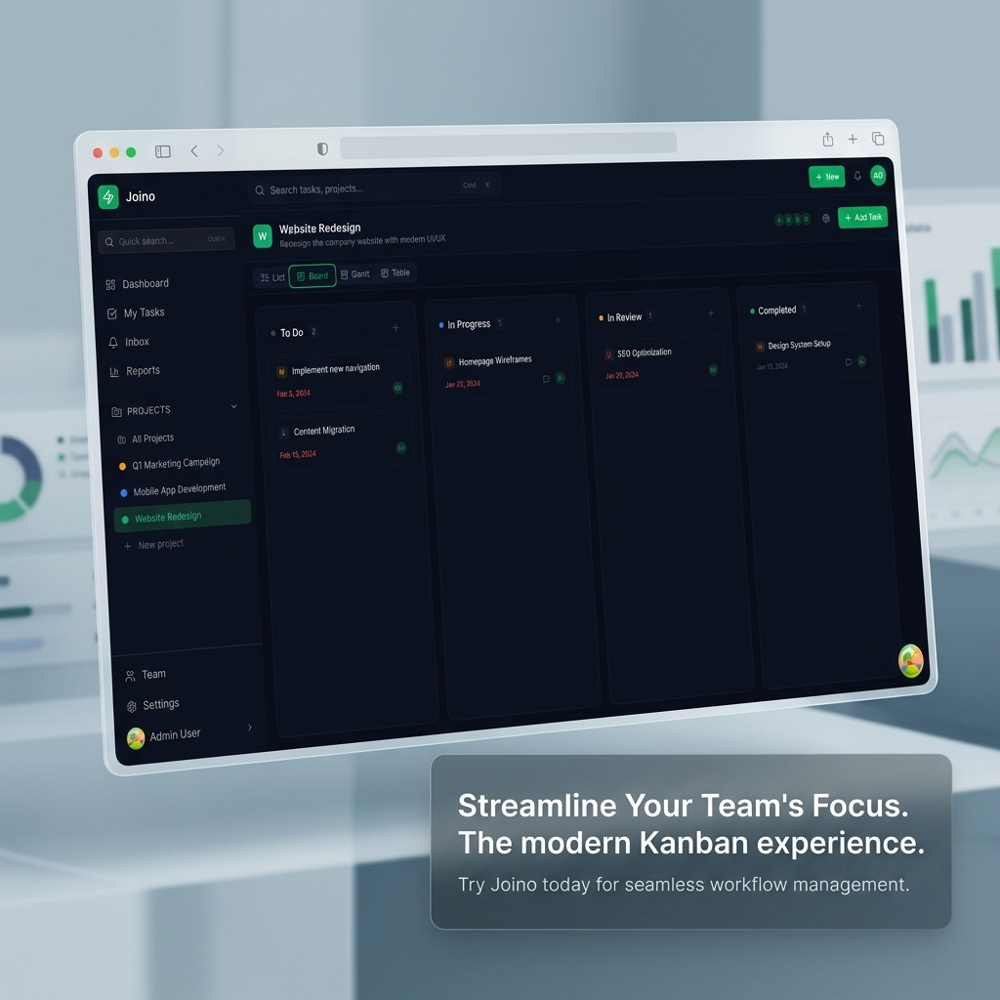
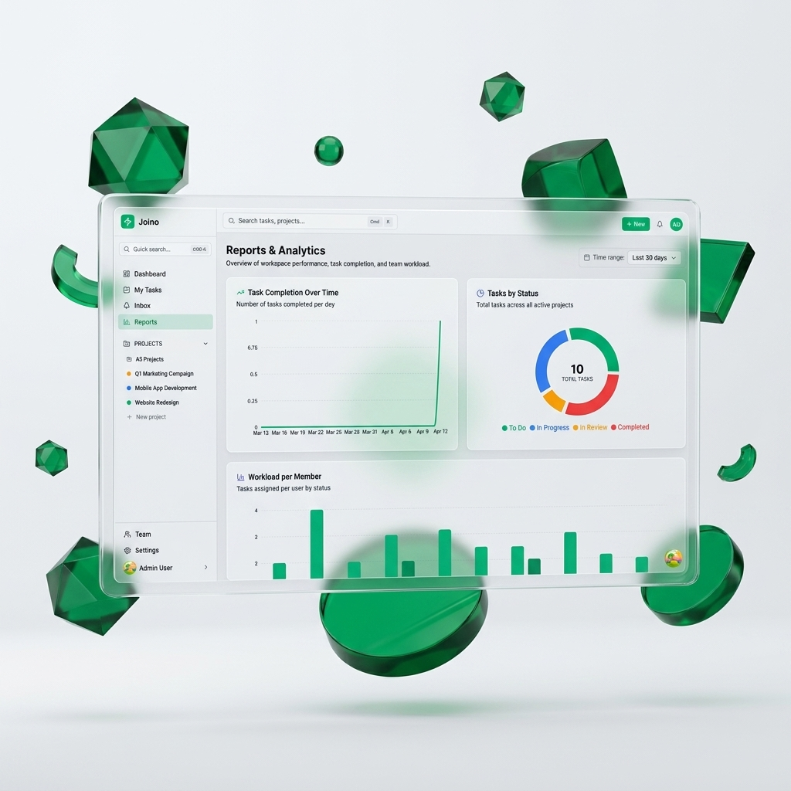
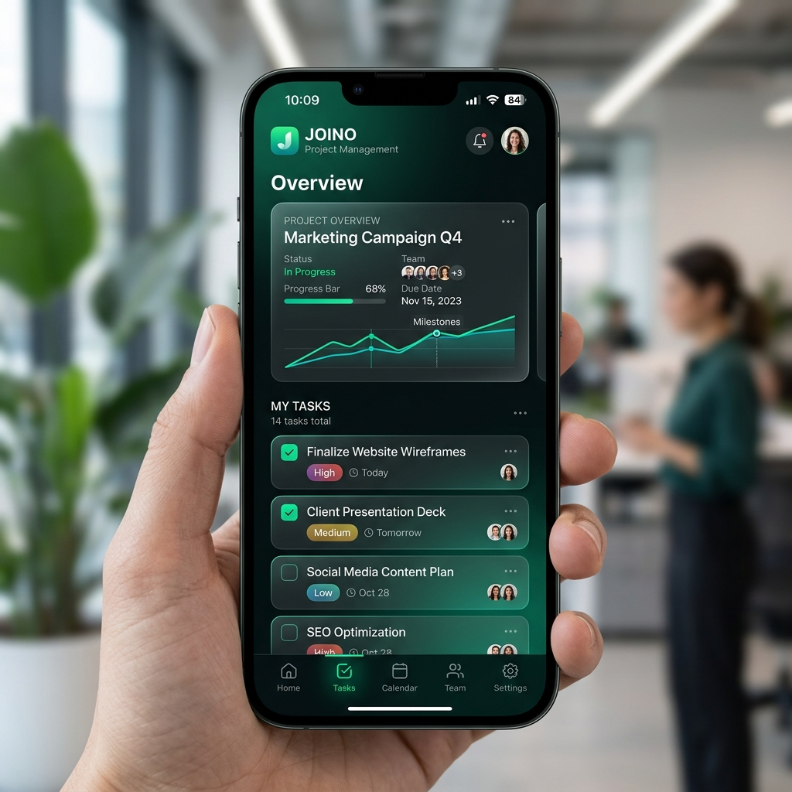

# <p align="center">🚀 Joino — Open-Source Enterprise Task Management</p>

<p align="center">
  
</p>

<p align="center">
  <a href="https://nextjs.org/"></a>
  <a href="https://nodejs.org/"></a>
  <a href="https://www.docker.com/"></a>
  <a href="https://opensource.org/licenses/MIT"></a>
</p>

---

**Joino** is a high-performance, **open-source project management platform** and a powerful **Wrike alternative**. Designed for teams that demand flexibility, speed, and a premium user experience, it serves as a comprehensive **self-hosted task management** solution for modern workflows.

<p align="center">
  [ <b>Live Demo</b> ](#) &nbsp; | &nbsp; [ <b>Documentation</b> ](#) &nbsp; | &nbsp; [ <b>Report Bug</b> ](https://github.com/huynhhuynh02/joino/issues)
</p>

---

## ✨ Key Features

### 🎯 1. Professional Kanban & Real-time Flow
Visualize your work with a high-fidelity Kanban board. Experience smooth drag-and-drop, instant status updates, and a clean interface that keeps your team focused.

<p align="center">
  
</p>

### 📊 2. Deep Analytics & Actionable Intelligence
Turn raw data into actionable insights. Our automated reporting engine tracks team velocity, project health, and resource allocation with stunning visualizations.

<p align="center">
  
</p>

### 📱 3. Mobile Presence
Stay connected to your projects anywhere. Joino is optimized for a seamless mobile experience, keeping your productivity alive on the go.

<p align="center">
  
</p>

---

## ⚡ Tech Stack

- **Frontend:** Next.js 16.2 (App Router), React 19.2, Tailwind CSS 3.4, shadcn/ui.
- **Backend:** Node.js 22, Express 5.2, Prisma 6.2 (ORM), PostgreSQL.
- **DevOps:** Fully Containerized with Docker & Docker Compose.

---

## 🚀 Quick Start with Docker

1. **Clone the repository:**
   ```bash
   git clone https://github.com/huynhhuynh02/joino.git
   cd joino
   ```

2. **Setup environment variables:**
   ```bash
   cp .env.example .env
   ```

3. **Launch the platform:**
   ```bash
   docker-compose up -d
   ```

---

## 📄 License
Distributed under the MIT License. See `LICENSE` for more information.

## 📞 Contact
Joino - [huynhhuynh02@gmail.com](mailto:huynhhuynh02@gmail.com)  
Project Link: [https://github.com/huynhhuynh02/joino](https://github.com/huynhhuynh02/joino)

---
<p align="center">
  <i>Developed with ❤️ by huynhhuynh02.</i>
</p>
